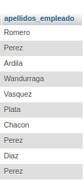
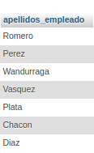
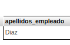
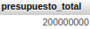
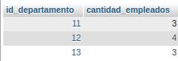
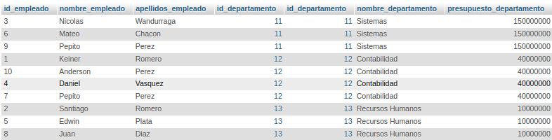
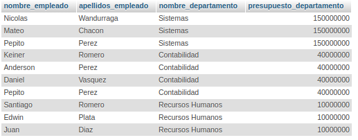

# consultas2_SQL

**CONSULTAS-ACTIVIDAD**

1 .Obtener la lista de los apellidos de todos los empleados.

`SELECT apellidos_empleado FROM Empleado;`

2.Obtener los apellidos de todos los empleados sin repeticiones.

`SELECT DISTINCT apellidos_empleado FROM Empleado;`

3.Obtener todos los datos de los empleados que se apellidan 'Gomez'.

`SELECT * FROM Empleado WHERE apellidos_empleado = 'Gomez';`

4.Obtener todos los datos de los empleados que se apellidan "Diaz" y los que se apellidan "Rodriguez".  Usar OR o IN

`SELECT * FROM Empleado WHERE apellidos_empleado = 'Diaz' OR apellidos_empleado = 'Rodriguez';`

5.Obtener los nombres de los empleados que trabajan en el departamento 11

`SELECT nombre_empleado FROM Empleado WHERE id_departamento = 11;`

6. Obtener todos los datos de los empleados cuyo apellido empiece por 'P'

`SELECT * FROM Empleado WHERE apellidos_empleado LIKE 'P%';`

7. Obtener el presupuesto total de todos los departamentos.

`SELECT SUM(presupuesto_departamento) AS presupuesto_total FROM Departamentos;`

8. Obtener el número de empleados de cada departamento.

`SELECT departamento_id, COUNT(*) AS cantidad_empleados FROM empleados GROUP BY departamento_id;`

9. Obtener un listado completo de empleados, incluyendo por cada empleado los datos del empleado y de su departamento.

`SELECT * FROM Empleado JOIN Departamento ON Empleado.id_departamento = Departamento.id_departamento;`

10. Obtener un listado completo de empleados, incluyendo el nombre y apellidos del empleado junto al nombre y presupuesto de su departamento.

`SELECT Empleado.nombre_empleado, Empleado.apellidos_empleado, Departamento.nombre_departamento, Departamento.presupuesto_departamento FROM Empleado JOIN Departamento ON Empleado.id_departamento = Departamento.id_departamento;`

11. Obtener los nombres y apellidos de los empleados que trabajen en departamentos cuyo presupuesto sea mayor a 100000000.

`SELECT Empleado.nombre_empleado, Empleado.apellidos_empleado FROM Empleado JOIN Departamento ON Empleado.id_departamento = Departamento.id_departamento WHERE Departamento.presupuesto_departamento > 100000000;`

